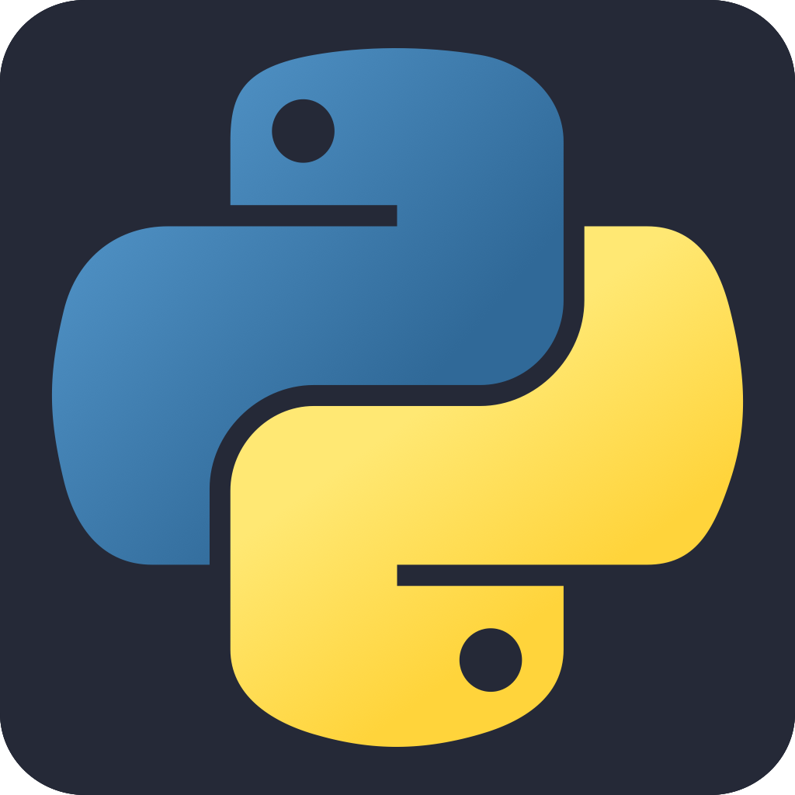
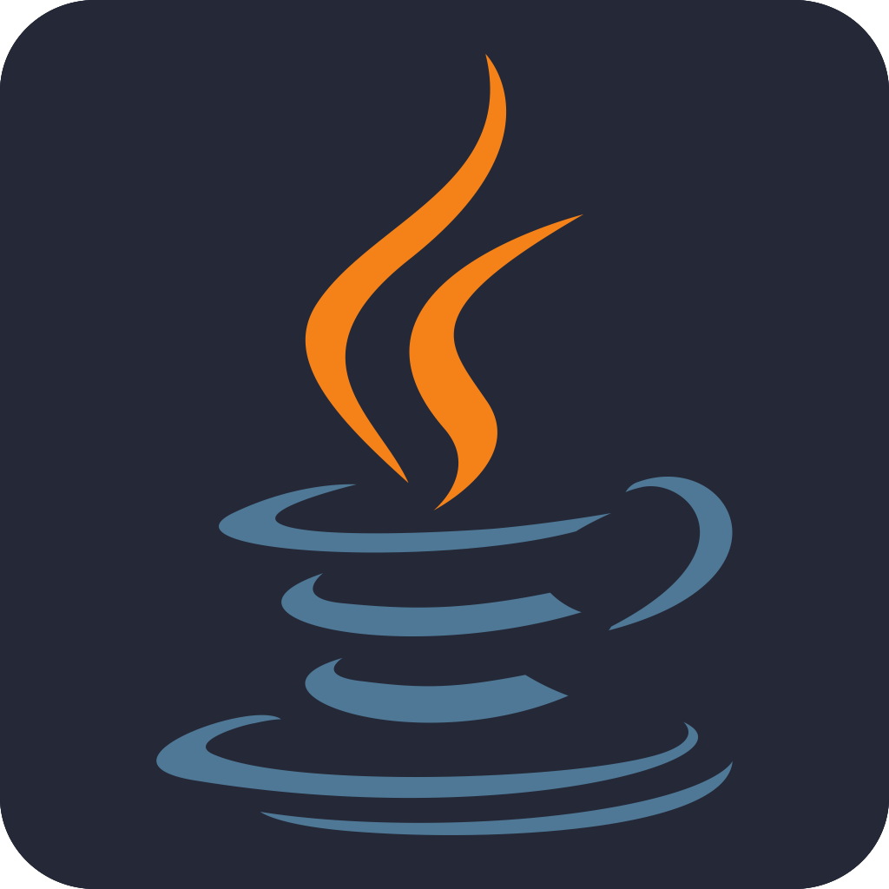
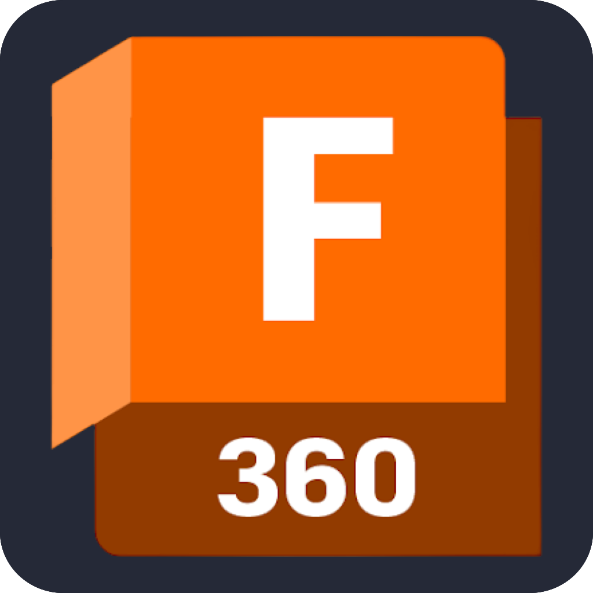
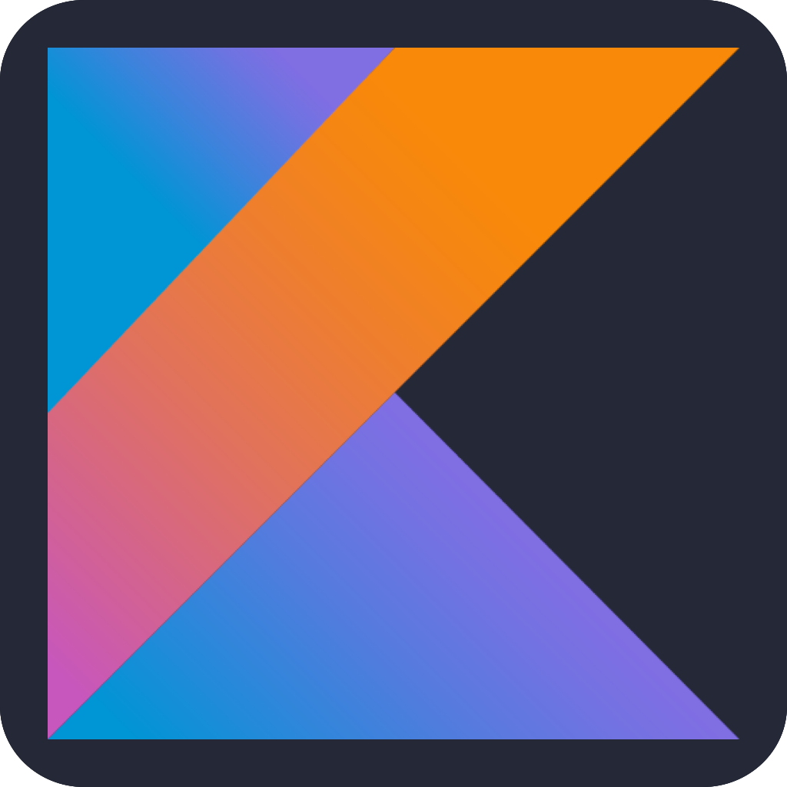

# Hello World, I'm Dervla 
<!-- put gif here -->
# I'm an  student studing at  

<!--## Contact Me:-->

## What I'm doing?
Currently: On residency @ [Transact Campus](https://transactcampus.com/)

Prevoiusly: 
- On residency @ [AWS](https://aws.amazon.com/)
- Studying @ [UL](https://www.ul.ie/) 

## Programming Languages & Tools (in order of knowledge:
          
 

## My Intrestets
- embedded systems & electronics
- 3d modeling & 3d printing
- cosplay
- comics & all general nerdy things
